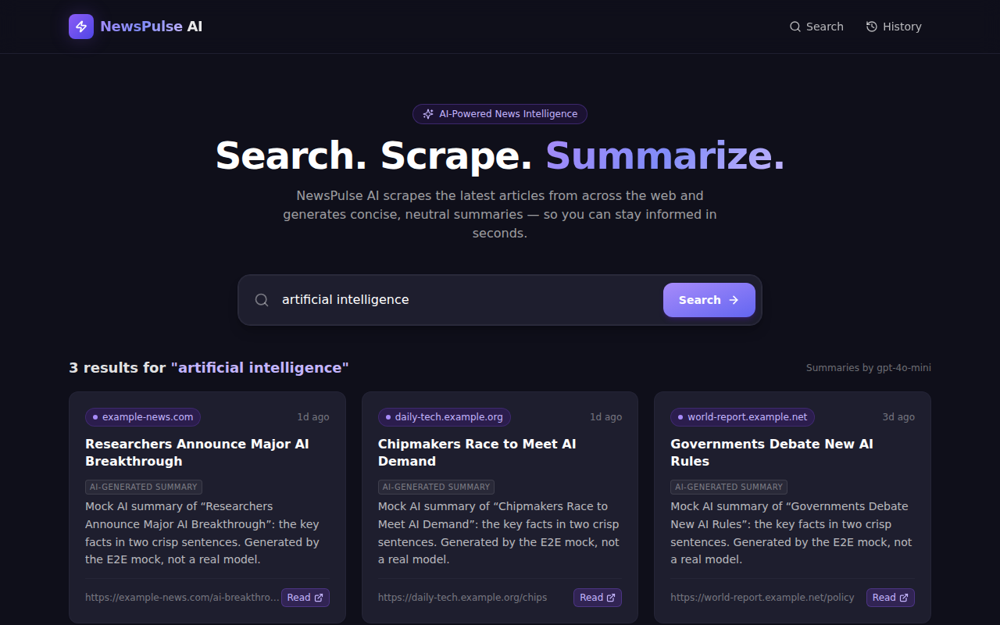
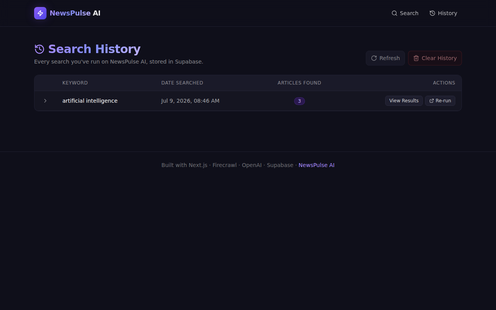

# 📰 NewsPulse AI

> **AI-Powered News Intelligence — Search. Scrape. Summarize.**

Search any topic and get the latest articles from across the web, each summarized into 2–3 crisp sentences by `gpt-4o-mini`. Sign in and every search is saved privately to your account (via Supabase Auth) so you can replay past queries, view results, or wipe the slate — and no one else can see your history. Anonymous visitors can still try a search; only signed-in customers’ searches are stored.

Built for the **Outskill AI Generalist Accelerator Hackathon**.

---

## 🛠️ Tech Stack


---

## 📸 Screenshots

> _Add screenshots here once you've deployed — drop them in `/public/screenshots/` and reference below._

| Search | History |
|---|---|
|  |  |

---

## ✨ Features

- 🔎 **Live web search** — Firecrawl `/v1/search` pulls fresh news for any keyword
- 🧠 **AI summaries** — every article is summarized in parallel by OpenAI `gpt-4o-mini`
- 🔐 **Accounts + private history** — Supabase Auth (email + password); each customer’s saved searches are theirs alone, enforced server-side and by RLS
- 💾 **Saved history** — signed-in customers’ queries + results are stored per-account in Supabase
- 📋 **History table** — keyword, date, count, expand-to-view, re-run, clear all
- 🛡️ **Spend protection** — user/IP-aware rate limiting, durable via Upstash when configured (honest in-memory fallback)
- 🩺 **Observability** — structured request-traced logs + a dependency-aware `/api/health`
- ✅ **Tested** — 36-test Vitest suite (validation, auth, cross-user isolation, rate limiting) wired into CI
- 📊 **Founder dashboard** — plain-language infrastructure health at `/founder`
- ⚡ **API-first** — `POST /api/search`, `GET/DELETE /api/history`, `GET /api/health`
- 🚀 **Vercel-ready** — auto-deploy on push via the Vercel GitHub integration

---

## 🚀 Setup

### 1. Clone & install

```bash
git clone https://github.com/<your-username>/newspulse-ai.git
cd newspulse-ai
npm install
```

### 2. Configure environment variables

```bash
cp .env.example .env.local
```

Fill in `.env.local` with your keys:

```bash
FIRECRAWL_API_KEY=fc-...
OPENAI_API_KEY=sk-proj-...
NEXT_PUBLIC_SUPABASE_URL=https://<ref>.supabase.co
NEXT_PUBLIC_SUPABASE_ANON_KEY=sb_publishable_...
SUPABASE_SERVICE_ROLE_KEY=sb_secret_...
```

Verify with the included script (it never prints full secrets):

```bash
npm run check-env
```

### 3. Run the Supabase schema + enable auth

- **Fresh project:** paste [`supabase/schema.sql`](./supabase/schema.sql) into the **Supabase SQL editor**. It creates the `news_searches` table (with a `user_id` owner column), indexes, and owner-only RLS policies.
- **Existing database** (created from an earlier version): run [`supabase/migrations/0002_auth_user_isolation.sql`](./supabase/migrations/0002_auth_user_isolation.sql) instead.
- In **Supabase → Authentication → Providers**, enable **Email**. (Email confirmation on/off is your choice; the login screen handles both.)

Optionally, for durable distributed rate limiting, create a free Redis at [Upstash](https://upstash.com) and set `UPSTASH_REDIS_REST_URL` / `UPSTASH_REDIS_REST_TOKEN`. Without them, rate limiting falls back to per-instance memory (reported at `/api/health`).

### 4. Start the dev server

```bash
npm run dev
```

Open [http://localhost:3000](http://localhost:3000). Click **Sign in** to create an account, or try a search anonymously.

### 5. Run the tests

```bash
npm test
```

36 tests cover input validation, authentication, cross-customer isolation, rate limiting, and the Founder dashboard data invariants. They need no network or live services.

---

## 🌐 Deploy to Vercel

### Option A — One-click via CLI

```bash
npm install -g vercel
vercel login
vercel link            # creates a project named "newspulse-ai"
vercel env add FIRECRAWL_API_KEY            # repeat for each var
vercel env add OPENAI_API_KEY
vercel env add NEXT_PUBLIC_SUPABASE_URL
vercel env add NEXT_PUBLIC_SUPABASE_ANON_KEY
vercel env add SUPABASE_SERVICE_ROLE_KEY
vercel --prod
```

### Option B — GitHub auto-deploy (active)

Connect the repository to the Vercel project (Vercel Dashboard → Project → Settings → Git). Vercel then builds and deploys automatically: every push to `main` goes to production, and every pull request gets a preview deployment with its own URL commented on the PR.

---

## 🔑 Where to get API keys

| Service | Link | What you need |
|---|---|---|
| Firecrawl | https://firecrawl.dev | API key (Dashboard → API Keys) |
| OpenAI | https://platform.openai.com/api-keys | API key |
| Supabase | https://supabase.com | Project URL + publishable + secret keys (Settings → API) |

---

## 📂 Project structure

```
newspulse-ai/
├── app/
│   ├── api/
│   │   ├── health/route.ts          # GET /api/health
│   │   ├── history/[id]/route.ts    # GET /api/history/:id, DELETE /api/history/:id
│   │   ├── history/route.ts         # GET /api/history, DELETE /api/history (clear all)
│   │   └── search/route.ts          # POST /api/search
│   ├── history/[id]/page.tsx        # /history/:id — single saved search
│   ├── history/page.tsx             # /history — table of all saved searches
│   ├── error.tsx                    # global error boundary
│   ├── globals.css                  # Tailwind + dark-theme tokens
│   ├── icon.tsx                     # programmatic favicon
│   ├── layout.tsx                   # root layout, header, footer, Inter font
│   ├── loading.tsx                  # route-transition skeleton
│   ├── not-found.tsx                # 404
│   ├── opengraph-image.tsx          # 1200×630 social card
│   ├── page.tsx                     # / — search UI
│   ├── robots.ts                    # robots.txt
│   └── sitemap.ts                   # sitemap.xml
├── components/
│   ├── EmptyState.tsx
│   └── NewsCard.tsx
├── lib/
│   ├── firecrawl.ts                 # Firecrawl /v1/search wrapper
│   ├── openai.ts                    # gpt-4o-mini summarizer
│   ├── supabase.ts                  # supabase client + helpers
│   └── utils.ts                     # cn() + date formatters
├── scripts/
│   └── check-env.mjs                # verify env vars without leaking values
├── supabase/
│   └── schema.sql                   # news_searches table + RLS
├── types/
│   └── index.ts                     # shared API types
├── .github/workflows/
│   └── ci.yml                       # lint, type-check, build
├── .env.example
├── middleware.ts                    # rate limit on /api/search
├── next.config.js
├── package.json
├── tailwind.config.js
├── tsconfig.json
└── vercel.json
```

---

## 🧪 Available scripts

```bash
npm run dev           # local dev server
npm run build         # production build
npm run start         # production server
npm run lint          # next lint
npm run type-check    # tsc --noEmit
npm run format        # prettier write
npm run check-env     # verify .env.local without printing secrets
```

---

## 🧠 How it works

```
User keyword
    │
    ▼
POST /api/search
    │
    ├─► 1. Firecrawl /v1/search       (web search + scrape, limit 10)
    │       returns title, url, markdown content per article
    │
    ├─► 2. OpenAI gpt-4o-mini         (parallel summarization, concurrency=4)
    │       returns 2–3 sentence neutral summary per article
    │
    ├─► 3. Supabase `news_searches`   (insert: keyword, results JSONB, count)
    │
    └─► returns { title, url, source, date, description, ai_summary }[]
```

---

## 🏆 Hackathon Notes

- **Project:** NewsPulse AI
- **Tagline:** *AI-Powered News Intelligence — Search. Scrape. Summarize.*
- **Differentiator:** Real-time AI summaries + persistent search history
- **Built for:** Outskill AI Generalist Accelerator Hackathon

---

## 📄 License

MIT — see [`LICENSE`](./LICENSE).
