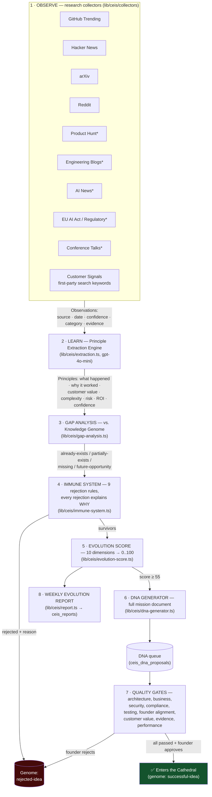
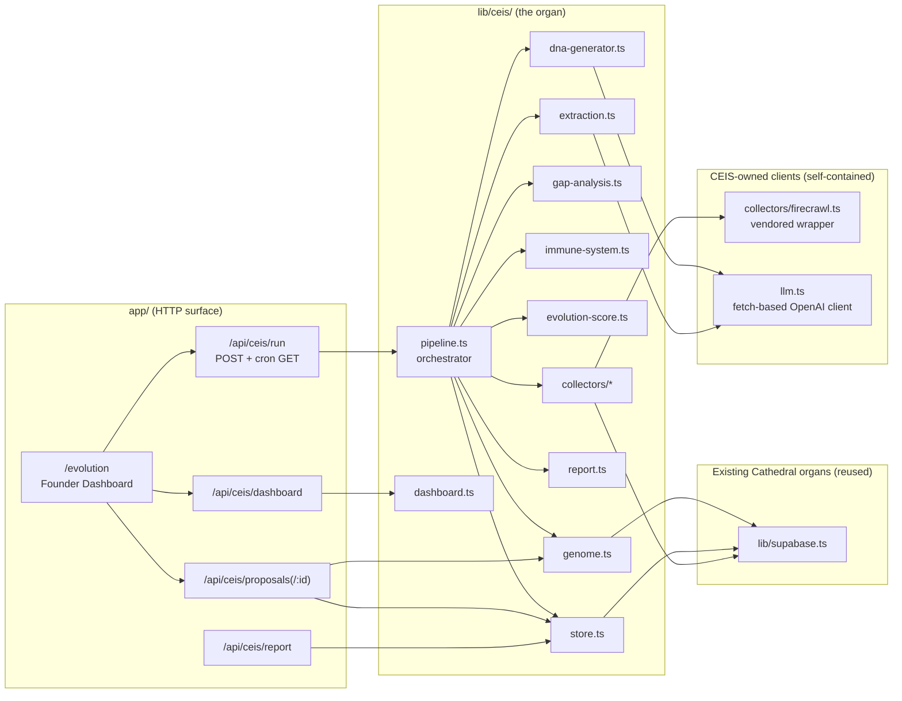

# 🧬 Cathedral Evolution Intelligence System (CEIS)

> **DNA-300** — the Cathedral's permanent evolution organ.
> Observe. Learn. Extract principles. Validate. Adapt. Improve. Measure. Repeat.

CEIS continuously studies the world's best **public** knowledge — AI startups,
engineering organizations, open source, research, regulation, and the
Cathedral's own customers — extracts **reusable principles** (never IP, never
code, never product clones), validates them against the Cathedral's genome,
and proposes evidence-based **DNA missions** that only enter the Cathedral
after passing nine quality gates and founder approval.

This document is the architecture reference. See also:

- [`CEIS-FOUNDER-GUIDE.md`](./CEIS-FOUNDER-GUIDE.md) — how to review DNA and read the weekly report
- [`CEIS-CTO-GUIDE.md`](./CEIS-CTO-GUIDE.md) — operations, extension points, failure modes
- [`CEIS-USER-GUIDE.md`](./CEIS-USER-GUIDE.md) — the `/evolution` dashboard and API

---

## The evolution cycle

\* Firecrawl-backed collectors — one shared implementation
(`collectors/web-research.ts`), enabled when `FIRECRAWL_API_KEY` is set.

## Module map

## Design principles

| Principle                      | How CEIS implements it                                                                                                                                                                                                        |
| ------------------------------ | ----------------------------------------------------------------------------------------------------------------------------------------------------------------------------------------------------------------------------- |
| **Ethics first**               | Collectors store only public metadata + short excerpts. The extraction prompt forbids copying features/code/IP; it extracts _mechanisms_. Every report footer restates this.                                                  |
| **Evidence or nothing**        | Every observation carries source, date, confidence, category, evidence. Principles without a real backing observation are dropped (`normalizePrinciple`). Confidence below 0.55 is auto-rejected.                             |
| **No duplicate DNA**           | Gap analysis compares against the genome; the immune system rejects `already-exists`, `duplicate-of-active-work`, and `previously-rejected` (unless confidence is ≥0.15 higher than at rejection time).                       |
| **Nothing self-approves**      | Every proposal is born `proposed` with nine `pending` gates. `approve` returns HTTP 409 until all gates pass. Approval/rejection is a founder action via `PATCH /api/ceis/proposals/:id`.                                     |
| **Autonomous, not disruptive** | Weekly Vercel cron (`0 6 * * 1`). Collector failures are isolated (`Promise.allSettled` + 20s timeouts); Supabase writes are best-effort; a broken source never blocks the cycle.                                             |
| **Reuse over rebuild**         | Firecrawl wrapper, OpenAI client, Supabase clients, middleware rate-limiting, UI theme — all reused, none duplicated.                                                                                                         |
| **Permanent memory**           | The genome (`ceis_genome`) records lessons, rejected ideas (with confidence at rejection), successful ideas, and architecture decisions. Rejected ideas are never rediscovered without new evidence.                          |
| **Degrade gracefully**         | Without `OPENAI_API_KEY`: heuristic extraction (deliberately low confidence → nothing reaches DNA). Without `FIRECRAWL_API_KEY`: web collectors skip. Without Supabase: cycle still runs, seed genome used, nothing persists. |

## Evolution Score model

`score = weighted(benefits, inverted costs) × (0.5 + 0.5 × confidence) × 100`

| Dimension           | Weight | Direction       |
| ------------------- | ------ | --------------- |
| Customer value      | 0.20   | benefit         |
| Launch impact       | 0.15   | benefit         |
| Strategic alignment | 0.15   | benefit         |
| Innovation          | 0.10   | benefit         |
| ROI                 | 0.10   | benefit         |
| Engineering cost    | 0.10   | cost (inverted) |
| Risk                | 0.10   | cost (inverted) |
| Maintenance cost    | 0.05   | cost (inverted) |
| Complexity          | 0.05   | cost (inverted) |

Confidence scaling means a brilliant idea with weak evidence cannot outrank a
solid idea with strong evidence. Proposals below **55/100** never become DNA.

## Data model (supabase/ceis-schema.sql)

| Table                | Contents                     | Notes                                                                                               |
| -------------------- | ---------------------------- | --------------------------------------------------------------------------------------------------- |
| `ceis_observations`  | raw signals                  | PK = stable content hash → idempotent re-observation                                                |
| `ceis_principles`    | extracted principles (JSONB) |                                                                                                     |
| `ceis_dna_proposals` | full mission docs            | `status` column is authoritative; new cycles never overwrite founder decisions (`ignoreDuplicates`) |
| `ceis_genome`        | permanent memory             | seed capabilities live in code (`lib/ceis/genome.ts`)                                               |
| `ceis_reports`       | weekly reports               | markdown + stats                                                                                    |

RLS is enabled with **no anon policies** — CEIS tables are server-only
(service-role key).

## Success criteria

CEIS is not measured by ideas collected. It is measured by: higher customer
value, higher product quality, higher engineering velocity, higher launch
readiness, lower technical debt, better architecture, continuous learning and
evidence-based evolution. Operationally that is: the Evolution Score trend,
learning velocity (genome growth), and the ratio of approved DNA that ships
and moves its declared metrics.
